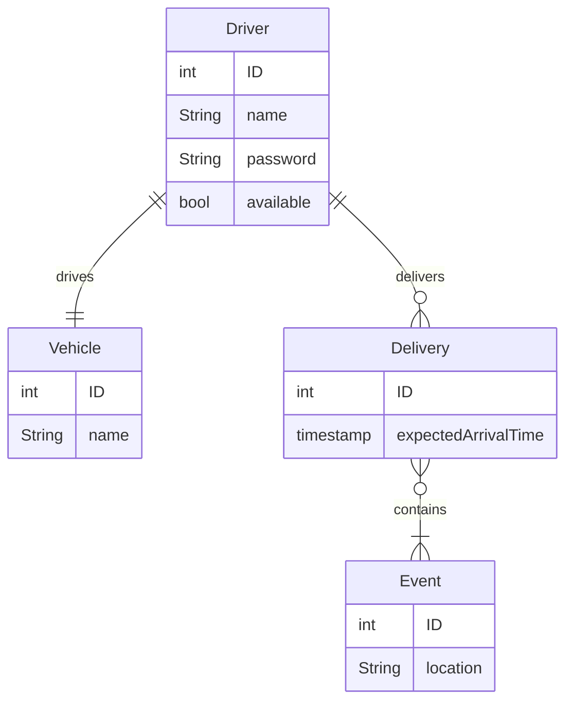

```mermaid
erDiagram
    Vehicle{
        int ID
        String name
    }
    Driver{
        int ID
        String name
        String password
        bool available
    }
    Delivery{
        int ID
        timestamp expectedArrivalTime
    }
    Event{
        int ID
        String location
    }

    Driver ||--|| Vehicle : drives
    Driver ||--o{ Delivery : delivers
    Delivery }o--|{ Event : contains
```